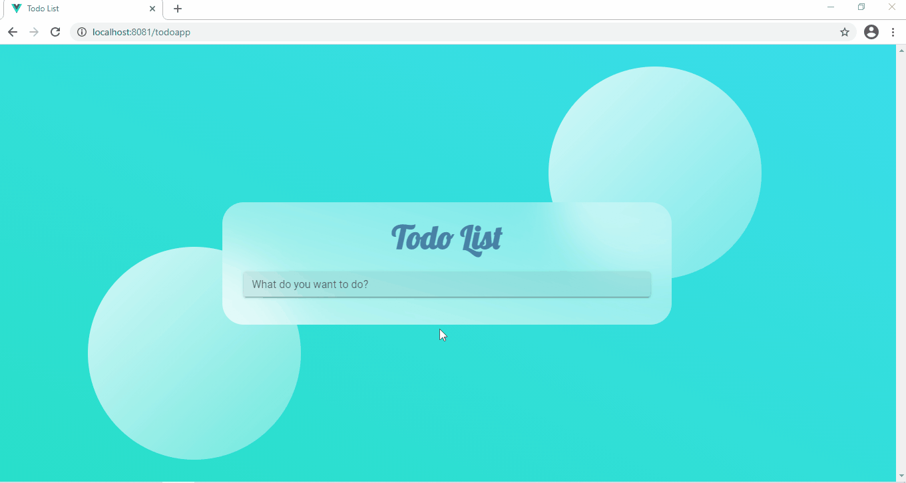

# Todo list

Todo list allows you to manage a list of tasks that you need to do. It performs adding, deleting and toggling state of each task. It has modern design and basic functionality.

## Getting Started

These instructions will get you a copy of the project up and running on your local machine for development and testing purposes. See the instructions below for notes on how to deploy the project on a live system.

## Preview


### Prerequisites

Things you need to be able to use this project:

* [Chrome](https://www.google.com/intl/en_ph/chrome/) - recommended to use for CSS reasons or [Firefox](https://www.mozilla.org/en-US/firefox/new/)
* Command prompt

### Installation

A step by step series of examples that tell you how to get a development env running

Type this in cmd:

```
cd../ProjectName
```
```
npm install
```
```
npm run serve
```

## Built With

* [Vue](https://vuejs.org/)
* [Vuetify](https://vuetifyjs.com/en/)
* [Vuex](https://vuex.vuejs.org/)

## Authors

* **Charnel Clamosa** - [charnelclamosa](https://github.com/charnelclamosa)

## License

This project is licensed under the MIT License - see the [LICENSE.md](LICENSE.md) file for details
